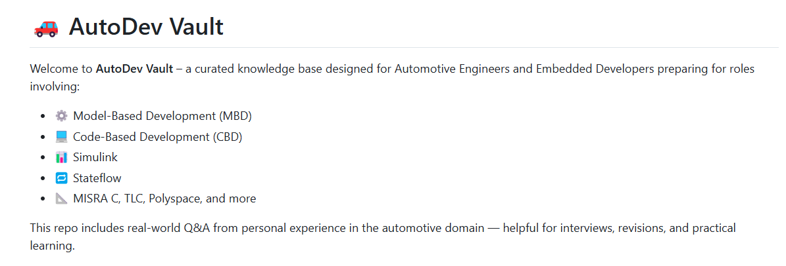

# 🚗 AutoDev Vault

Welcome to **AutoDev Vault** – a curated knowledge base designed for Automotive Engineers and Embedded Developers preparing for roles involving:

- ⚙️ Model-Based Development (MBD)
- 💻 Code-Based Development (CBD)
- 📊 Simulink
- 🔁 Stateflow
- 📐 MISRA C, TLC, Polyspace, and more

This repo includes real-world Q&A from personal experience in the automotive domain — helpful for interviews, revisions, and practical learning.

---

## 🌐 Live Site

✨ View the interactive site here:  
👉 [AutoDev Vault – GitHub Pages](https://mahija07.github.io/Automotive_MBD_questionnaire/)

---

## 📱 AutoDev Vault – Mobile App

A handy app for engineers to access automotive Model-Based Dev questions.

### 🔽 Download the latest APK
[Click here to download](https://github.com/Mahija07/Automotive_MBD_questionnaire/releases/download/v1.0.0/app-release.apk)

---

## 🧭 Explore by Topic

| Topic | Description |
|-------|-------------|
| [⚙️ MBD - Model-Based Development](docs/mbd.md) | Simulation, code gen, TLC, SIL/MIL |
| [💻 CBD - Code-Based Development](docs/cbd.md) | Embedded C, MISRA, GTest, unit testing |
| [📊 Simulink](docs/simulink.md) | Solvers, block types, signals, subsystems |
| [🔁 Stateflow](docs/stateflow.md) | States, events, charts, temporal logic |

---

## 🖼 Preview

  
*A sneak peek of the Q&A site powered by MkDocs Material*

---

## 💡 Features

- 🎯 Question & Answer Format  
- 📄 Markdown-Powered Docs  
- 🌈 Interactive layout with collapsible sections  
- 🛠 MkDocs + Material theme  
- 🌐 GitHub Pages Hosting  
- 🔍 Built-in search & responsive UI  

---

## 🛠 Tech Stack

| Tool | Purpose |
|------|---------|
| [MkDocs](https://www.mkdocs.org/) | Static site generator |
| [Material for MkDocs](https://squidfunk.github.io/mkdocs-material/) | UI & styling |
| Markdown | Q&A content |
| GitHub Pages | Hosting the site |

---

## 🤝 Contributions

While this is a personal vault, I welcome suggestions or improvements. If you'd like to contribute a question set or corrections:

- Fork this repo
- Create a branch
- Submit a Pull Request  
🛑 *Please avoid sharing proprietary or confidential info.*

---

## 📬 Contact

📧 mahija@example.com  
🔗 [LinkedIn](https://linkedin.com/in/your-profile)

---

> 🔐 This repo is your technical companion — revisit often, keep updating, and stay interview-ready!

Made with ❤️ by Mahija