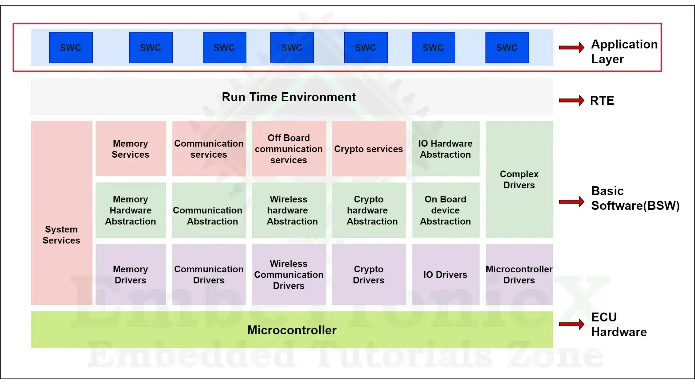

# 📚 AUTOSAR

## 💼 What is AUTOSAR?
<a class="back-sidebar-btn" href="javascript:history.back()">⬅️ Back</a>

**AUTOSAR** stands for **AUTomotive Open System ARchitecture**.  
It’s a worldwide development partnership of vehicle manufacturers, suppliers, and tool developers established to create and implement an **open and standardized software architecture for automotive ECUs** (Electronic Control Units).

---

## 🗓️ When was AUTOSAR introduced?

- **Founded in 2003**
- Major industry adoption started around **2006–2009**
- Continues evolving with versions like **Classic Platform** and **Adaptive Platform**

---

## 🌍 Where is AUTOSAR used?

AUTOSAR is used across:
- **Passenger cars**
- **Commercial vehicles**
- **EV platforms**
- **ADAS (Advanced Driver Assistance Systems)**
- **Powertrain, Chassis, Body, and Infotainment systems**

Anywhere you have **ECUs with safety, scalability, and reusability requirements**, AUTOSAR is likely in the background.

---

## ❓ Why do we use AUTOSAR?

### Key reasons:
- **Standardization:** Ensures interoperability across OEMs and suppliers
- **Reusability:** Software components can be reused across projects and ECUs
- **Scalability:** Supports small ECUs to high-performance compute units
- **Safety & Security:** Built-in support for ISO 26262 (functional safety) and cybersecurity
- **Reduced development effort:** Thanks to common interfaces and tools

---

## ⚙️ How do we use AUTOSAR?

AUTOSAR development typically follows this flow:

1. **System Design:** Define software components, their interfaces, and communication
2. **Software Component Development:** Using tools like MATLAB/Simulink or hand-coding in C
3. **Configuration:** Configure Basic Software (BSW), RTE (Run-Time Environment), and MCAL using AUTOSAR tools (e.g., DaVinci Developer, EB tresos)
4. **Integration:** Components and configurations are integrated into the ECU
5. **Testing & Validation:** Using HIL/SIL setups, test tools, and compliance checks

AUTOSAR is implemented via:
- **AUTOSAR Classic Platform (CP):** For deeply embedded systems (e.g., body controllers, engine ECUs)
- **AUTOSAR Adaptive Platform (AP):** For high-performance computing (e.g., autonomous driving, infotainment)

---

## ✅ Benefits of AUTOSAR

| Benefit              | Description                                                                 |
|----------------------|-----------------------------------------------------------------------------|
| 🔁 Reusability         | Develop once, reuse across platforms and projects                         |
| 🌐 Interoperability     | Standardized interfaces promote multi-vendor integration                 |
| 🔒 Safety & Security   | Compliant with ISO 26262 and cybersecurity standards                      |
| ⚡ Scalability         | Supports both small ECUs and powerful domain controllers                  |
| 🧩 Modularity          | Separates application software from hardware and infrastructure software |
| 🚀 Faster Development | Reduces integration and testing efforts                                   |

Absolutely! Let’s start with a structured explanation of the **AUTOSAR Architecture Layers**, followed by **interview questions and answers** that are commonly asked.

---

## 💡 AUTOSAR Architecture – Layers Overview

AUTOSAR (Classic Platform) is designed in a **layered architecture** to separate concerns and standardize interaction between application software and hardware.

Here are the **main layers**:

---

### 1. **Application Layer**
- **What it is:** Contains all **Application Software Components (SWCs)**.
- **Function:** Each SWC performs specific functions like controlling lights, wipers, or airbags.
- **Independence:** SWCs are hardware-independent and communicate via ports and interfaces.
- **Example:** A LightControl SWC sends signal to the Body Control Module.

---

### 2. **Run-Time Environment (RTE)**
- **What it is:** Acts as a **middleware** between Application Layer and Basic Software (BSW).
- **Function:** Maps data and service communication between SWCs and BSW modules.
- **Generated by tools** based on software architecture.
- **Think of it as:** A **router** that connects components.

---

### 3. **Basic Software (BSW)**
This is the backbone of AUTOSAR and has 3 sub-layers:

#### a. **Service Layer**
- Provides **system services** like:
  - Memory management
  - Diagnostic services
  - OS abstraction
  - Communication services

#### b. **ECU Abstraction Layer**
- Makes higher layers **independent of the ECU hardware**.
- Provides uniform APIs to access internal/external peripherals.

#### c. **Microcontroller Abstraction Layer (MCAL)**
- The **lowest software layer**.
- Directly interfaces with microcontroller hardware (ADC, GPIO, SPI, etc.).
- Provides **standardized APIs** for upper layers.

---

### 4. **Microcontroller Layer**
- The **actual hardware** of the ECU.
- Contains CPU, memory, timers, peripherals, etc.

---

##  🧠 AUTOSAR Architecture – Summary Diagram

```
+---------------------------+
|     Application Layer     |  <-- Software Components
+---------------------------+
|           RTE             |  <-- Middleware
+---------------------------+
|        Basic Software     |  
|  +---------------------+  |
|  |     Service Layer   |  |
|  +---------------------+  |
|  | ECU Abstraction Lyr|  |
|  +---------------------+  |
|  |       MCAL          |  |
+---------------------------+
|   Microcontroller Layer   |  <-- Hardware
+---------------------------+
```


---

## 📋 AUTOSAR Interview Questions & Answers

---

**1. What is AUTOSAR?**  
AUTOSAR (AUTomotive Open System ARchitecture) is a standardized software architecture developed to improve modularity, scalability, and reusability in automotive ECUs.

**2. Why do we use AUTOSAR?**  
To standardize software development, reduce development cost and effort, support scalability across vehicle lines, and facilitate software reuse across projects and OEMs.

**3. When was AUTOSAR developed?**  
Initiated in 2003 by BMW, Bosch, Continental, Daimler, Siemens VDO, and VW, aiming for open and standard architecture for automotive ECUs.

**4. Where is AUTOSAR used?**  
Across all automotive domains—body electronics, powertrain, chassis, infotainment—anywhere ECUs require structured, reliable software.

**5. How is AUTOSAR used?**  
Through layered architecture: application layer (SWCs), RTE, and BSW. Tools configure components and generate code for integration on hardware.

**6. What are the main layers in AUTOSAR architecture?**  
- Application Layer  
- RTE (Run-Time Environment)  
- Basic Software (BSW)  
- Microcontroller Abstraction (MCAL)  
- ECU Hardware

**7. What is the Application Layer in AUTOSAR?**  
It contains Software Components (SWCs) implementing specific functionalities like wiper control, lighting, etc.

**8. What is the RTE in AUTOSAR?**  
The RTE acts as middleware that facilitates communication between SWCs and between SWCs and BSW without knowing their implementation.

**9. What is BSW in AUTOSAR?**  
Basic Software includes modules for communication, memory, diagnostics, and ECU abstraction—everything below RTE down to the microcontroller.

**10. What are BSW layers?**  
- Services Layer  
- ECU Abstraction Layer  
- MCAL (Microcontroller Abstraction Layer)

**11. What is MCAL?**  
It abstracts the microcontroller hardware so that software can be reused regardless of hardware changes.

**12. What is ECU Abstraction Layer?**  
It hides hardware differences and provides uniform access to peripherals like ADC, EEPROM, PWM, etc.

**13. What is the Services Layer?**  
It provides system services such as diagnostics (DEM, DCM), communication, memory (NvM), and mode management.

**14. What is a Software Component (SWC)?**  
A reusable unit of software containing business logic. It uses well-defined interfaces and can be deployed on different ECUs.

**15. What is an AUTOSAR Interface?**  
It defines how components communicate—either Sender-Receiver (S-R) or Client-Server (C-S).

**16. What is Sender-Receiver Communication?**  
One component sends data; the other receives it. It's used for unidirectional signal flow.

**17. What is Client-Server Communication?**  
Client requests a service; server responds. It's synchronous or asynchronous.

**18. What is the role of RTE in communication?**  
RTE routes data between SWCs or between SWCs and BSW, ensuring separation and abstraction.

**19. How are SWCs mapped to ECUs?**  
Using system configuration tools, SWCs are allocated to ECUs, which then communicate through generated RTE and BSW.

**20. What is a Port in AUTOSAR?**  
A logical interface used by SWCs to connect to other SWCs or to services via RTE.

**21. What is a Runnable in AUTOSAR?**  
A piece of code within an SWC that gets triggered based on events like timing or data reception.

**22. What is the role of Basic Software Mode Manager (BSWM)?**  
It handles mode switching between different ECU states like startup, shutdown, or diagnostic mode.

**23. What is DEM (Diagnostic Event Manager)?**  
Manages diagnostic events, statuses, and DTCs (Diagnostic Trouble Codes).

**24. What is DCM (Diagnostic Communication Manager)?**  
Handles diagnostic communication with external tools (e.g., via UDS services).

**25. What is NvM (Non-Volatile Memory Manager)?**  
Manages data storage and retrieval from non-volatile memory like EEPROM or Flash.

**26. What is COM module?**  
It handles signal-level communication between SWCs and the communication stack (CAN, LIN, etc.).

**27. What is the PDU Router?**  
Routes Protocol Data Units between modules like COM, CAN Interface, and Transport Protocol layers.

**28. What is CAN Interface (CANIf)?**  
An abstraction layer between CAN driver and upper layers, responsible for buffering and interrupt handling.

**29. What is CAN Driver?**  
Lowest-level module that interfaces directly with the CAN controller hardware.

**30. What is E2E Protection?**  
End-to-End protection adds CRC, counter, and timestamp to ensure data integrity across network transmission.

**31. What is a PDU?**  
Protocol Data Unit. It’s a unit of data exchanged between layers of the communication stack.

**32. What is configuration in AUTOSAR?**  
Setting up parameters (ports, interfaces, memory, modes) using tools to generate required code and XML files.

**33. What are ARXML files?**  
AUTOSAR XML files that store configuration and architecture definitions like SWCs, interfaces, and ECUs.

**34. What tools are used in AUTOSAR development?**  
Examples: Vector DaVinci Developer, Elektrobit Tresos, ETAS ISOLAR, Mentor Volcano.

**35. What is meant by “AUTOSAR Classic”?**  
The traditional AUTOSAR platform for deeply embedded systems (ECUs with limited resources).

**36. What is “AUTOSAR Adaptive”?**  
A newer platform for high-performance ECUs, supports POSIX, service-oriented communication, dynamic reconfiguration.

**37. What is Mode Management in AUTOSAR?**  
Manages operating modes like Normal, Sleep, Diagnostic using BSWM, Mode Manager, and RTE mode ports.

**38. What is Memory Stack in AUTOSAR?**  
Includes modules like NvM, EA (EEPROM abstraction), FEE (Flash EEPROM Emulation), and MEMIF.

**39. What is Watchdog Manager (WDGM)?**  
Monitors system tasks and detects software failure or system hangs. Can reset ECU if needed.

**40. What is Safety in AUTOSAR (ASIL)?**  
AUTOSAR supports ISO 26262 safety standards. ASIL defines the risk level of a function from A (low) to D (high).

**41. What is the role of OS in AUTOSAR?**  
The AUTOSAR OS manages task scheduling, events, alarms, and resources for SWCs and BSW.

**42. What is an OSEK OS?**  
AUTOSAR Classic OS is based on the OSEK/VDX standard—used for task management in automotive ECUs.

**43. What is the difference between IOC and RTE communication?**  
IOC (Inter-OS Application Communication) is for real-time task-to-task communication; RTE handles SWC communication.

**44. What is VFB in AUTOSAR?**  
Virtual Function Bus is a conceptual layer where all SWCs interact via RTE as if they’re on the same ECU.

**45. What are the benefits of AUTOSAR?**  
- Software reuse  
- Scalability  
- Standardization  
- Reduced integration effort  
- OEM-supplier decoupling

**46. What is Post-Build Configuration?**  
Configuration done after compilation, allowing flexible updates without changing the application binary.

**47. What is the difference between Pre-Compile, Link-Time, and Post-Build Configuration?**  
- Pre-Compile: Fixed at compile time  
- Link-Time: Changeable before linking  
- Post-Build: Changeable at runtime/configuration tools

**48. What is a Complex Device Driver (CDD)?**  
Custom, non-standard driver used when no AUTOSAR standard module exists for a device.

**49. What is Integration Testing in AUTOSAR?**  
Testing the integrated BSW, RTE, and SWCs together to validate communication and behavior across modules.

**50. What are some common AUTOSAR interview topics?**  
- Communication stacks (CAN, LIN)  
- Diagnostic stack (DEM, DCM)  
- MCAL and abstraction layers  
- RTE and SWC development  
- Configuration flow and tools  
- Software integration and safety